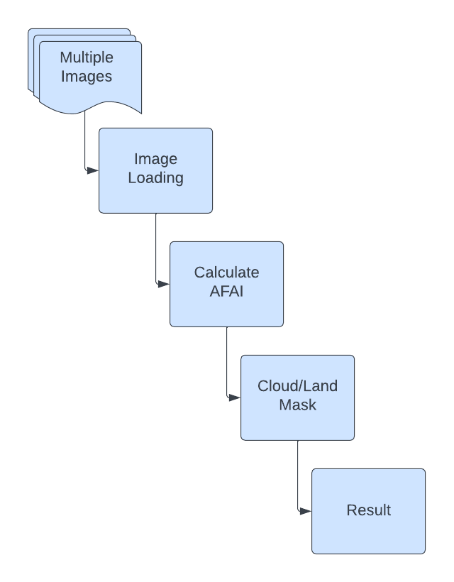
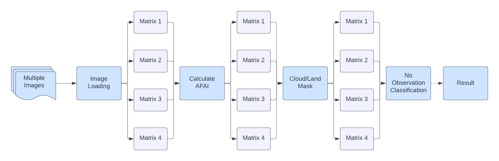

# Parallelization of Alternative Floating Algae Index (AFAI) calculation in Landsat images.

## Methods

The implementation of the algorithm was divided into two parts: a pipeline parallelism implementation that would handle the workflow and keep the bands to their own image and a data parallelism implementation that would handle all mathematical calculations that were necessary.
    
### Pipeline Parallelism 
The implementation of the workflow is done through Dask, which can parallelize collections such as numpy arrays  or Pandas dataframes, however it also provides parallelization for custom algorithms with the "delayed" interface.  The process is similar to the sequential implementation that existed however now it takes advantage of Dask as seen on the figure below. The advantage of this type of parallelization is that even if Image Loading has only finished for one image, that image will immediately start the process to calculate the AFAI without the need to wait for the others unrelated images.Some task like "get_mask" do not depend from anything to be processed so naturally their execution starts quickly and is ready to be processed as soon as the other dependency finishes.

### Data Parallelism

For the second part of the implementation the mathematical capability of the GPUs will be utilized. This is done because the CPU is already occupied with managing the pipeline parallelism and the system could get overwhelmed. To achieve this pyopencl is used instead of CUDA, this is due to hardware limitations since CUDA is only available to NVIDIA GPUs. GPUs have superior processing power and more storage and memory bandwidth which greatly helps solving this problem. These use a Single Instruction, Multiple Data (SIMD) architecture which helps in parallelization tasks and since most of the calculations needed are pixel by pixel this will help greatly in performance. On the figure below the two processes are combined into one workflow. 

## Results